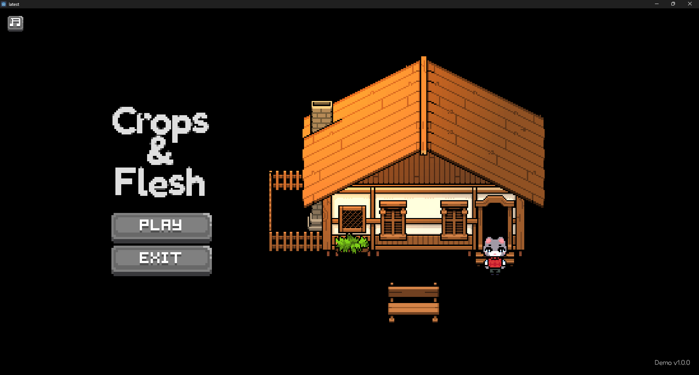
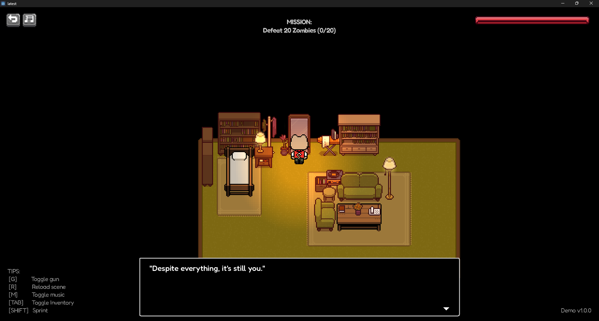
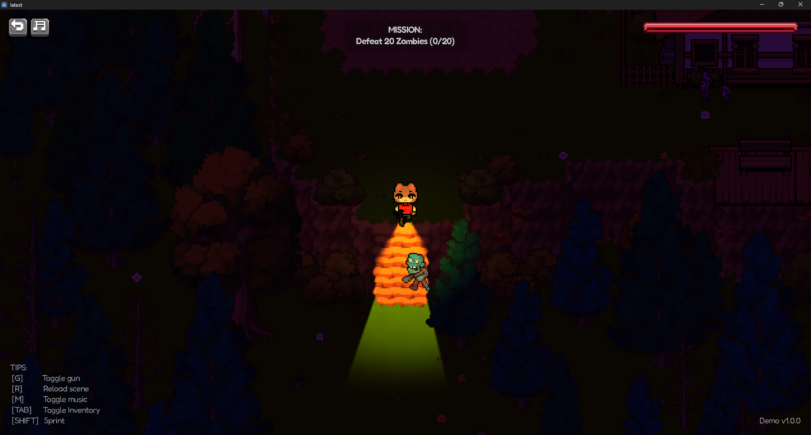
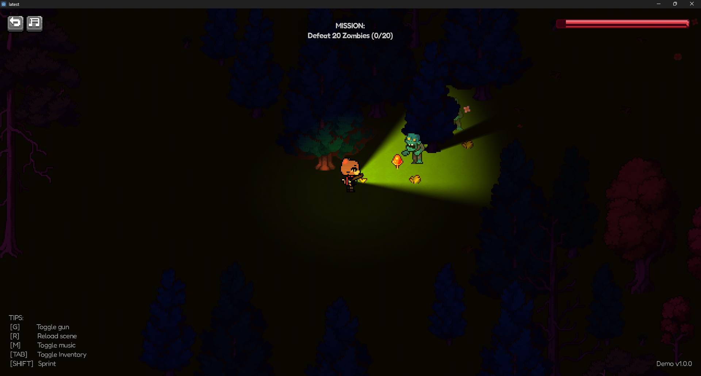

<h1 align="center"> Crops & Flesh (Alpha Demo) </h1>
<h3 align="center"> Overview </h3>

**Crops & Flesh** is a top-down pixel art survival RPG, developed as part of an academic game project, that blends cozy farming gameplay with light horror, and dark comedy. The game places the player in a quiet rural environment where daily routines such as farming, crafting, and eating are slowly disrupted by hoards of enemies.

The core experience focuses on survival under pressure, where every action, what to grow, what to eat, and how to process resources, has long-term consequences. The contrast between peaceful farm life and escalating danger is central to the game’s identity.

## ​ Gameplay Video (Alpha) 

[](https://youtu.be/1ODa7_0328M)

<p align="center">
  Click to redirect to YouTube
</p>

Video demonstrates the following:
- Basic movement
- Player explores enclosed environments
- Placeholder shooting mechanic
- HUD-based interactions
- Environmental lighting used to enhance tension
- Designed as an **early alpha demo** (not a full game yet)

## ​ Screenshots









## ​ Visual Style & Mood 

### Visual Style
- Top-down 2D perspective
- Pixel-art
- Dark atmosphere
- Limited visibility

### Mood
- Tense  
- Isolated  
- Survival-oriented  

## ​ Visual Assets Used

### Tile Sets
- **Pixel Crawler** by Anokolisa  
  https://anokolisa.itch.io/free-pixel-art-asset-pack-topdown-tileset-rpg-16x16-sprites  

- **Top Down House** by Penzilla  
  https://penzilla.itch.io/top-down-retro-interior  

### Sound Effects
- Pixabay Sound Effects  
  https://pixabay.com/sound-effects/  

All assets are used for **educational and non-commercial purposes**.


## ​ Technologies & Features
- **Game Engine:** Godot Engine 4.5.1
- **Language:** GDScript  
- **Platform:** PC (Desktop)  

This repository includes an **Alpha version release** demonstrating:
- Core movement
- Tiles and Player collision
- Shooting mechanics
- Lighting effects
- HUD buttons

Future versions will expand gameplay, polish visuals, and add content. :p


## Installation & Running

```bash
# Clone the repo
git clone https://github.com/Chansovisoth/Crops-Flesh-Demo.git

# Navigate to project folder
cd Crops-Flesh-Demo

# Open the project using Godot Engine (4.5.x or later)
```
EDIT: Stickers belong to: [Fir](https://www.youtube.com/c/simplyfir)