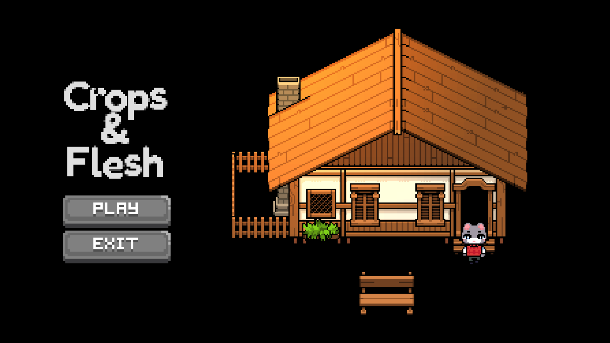
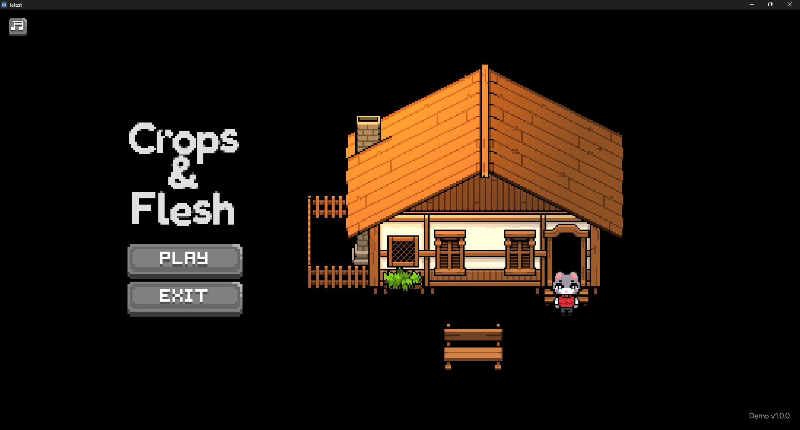
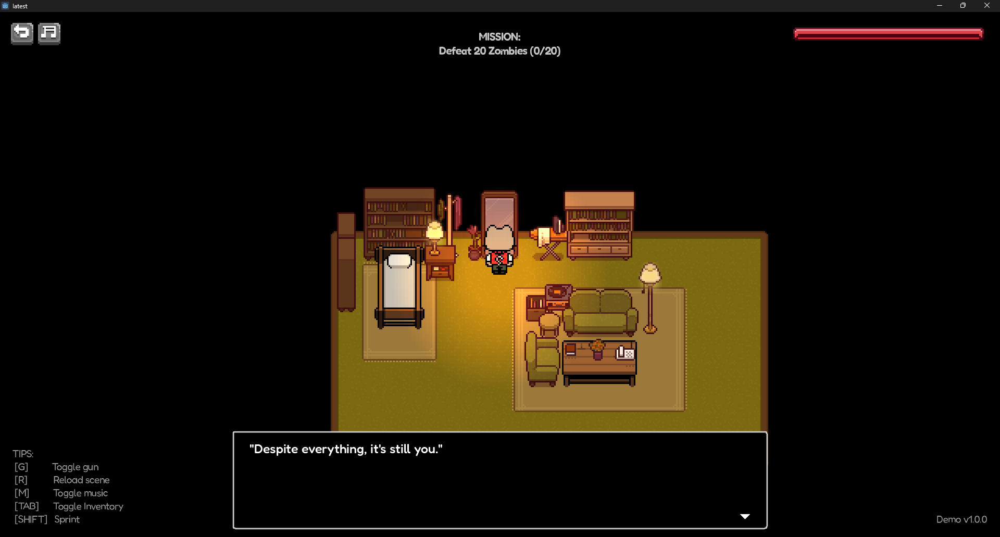
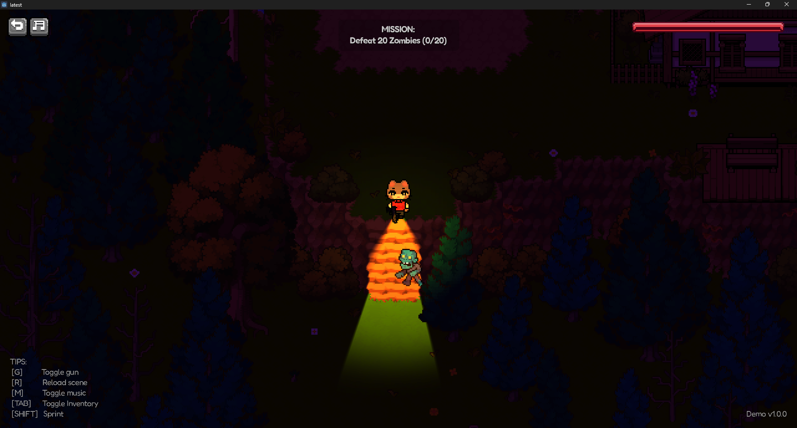
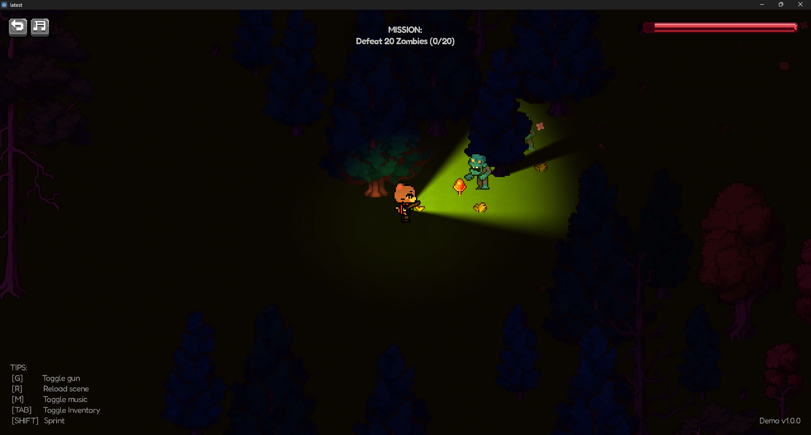
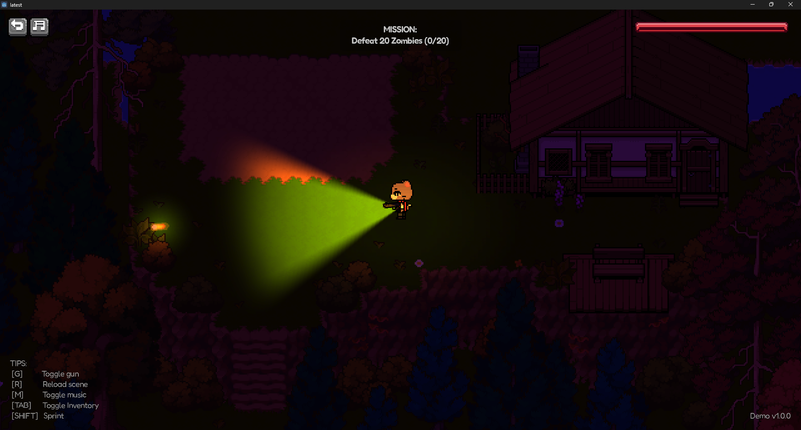

<h1 align="center"> Crops & Flesh </h1>
<h3 align="center"> Overview </h3>

**Crops & Flesh** is a top-down pixel art survival RPG developed as part of an academic game project. It blends light horror, dark comedy, and survival mechanics in a quiet rural setting slowly overtaken by hordes of enemies.

The game places the player in a once-peaceful countryside where survival becomes the main priority. Players must explore and defend themselves against waves of undead threats.

## ​ Gameplay Video 

<p align="center">
  <a href="https://youtu.be/p7yA_Xa26Ng?si=PobVbqudLMAOWJdc">
    
  </a>
</p>

<p align="center">
  Click to redirect to YouTube
</p>

## ​ Screenshots











## ​ Visual Style & Mood 

### Visual Style
- Top-down 2D perspective
- Pixel-art
- Dark atmosphere
- Limited visibility

### Mood
- Tense  
- Isolated  
- Survival-oriented  

## ​ Visual Assets Used

### Tile Sets
- **Pixel Crawler** by Anokolisa  
  https://anokolisa.itch.io/free-pixel-art-asset-pack-topdown-tileset-rpg-16x16-sprites  

- **Top Down House** by Penzilla  
  https://penzilla.itch.io/top-down-retro-interior  

### Music
- **Blood in the Snow [Instrumental, ft. Hatsune Miku]** by Jaelynn Laveren  
  https://www.youtube.com/watch?v=GbUdeXDz604

- **Better off Dead** by Chris Huelsbeck  
  https://www.youtube.com/watch?v=nBMzytPjC9g

### Sound Effects
- Pixabay Sound Effects  
  https://pixabay.com/sound-effects/  

All assets are used for **educational and non-commercial purposes**!


## ​ Technologies & Features
- **Game Engine:** Godot Engine 4.5.1
- **Language:** GDScript  
- **Platform:** PC (Desktop)  

AI Disclosure:
- AI model used: ChatGPT
- Helped me fix faulty scripts and come up with complex code that my brain can never comprehend :'I

This is all I got for now. More to see in the future.


## Installation & Running

```bash
# Clone the repo
git clone https://github.com/Chansovisoth/Crops-Flesh-Demo.git

# Navigate to project folder
cd Crops-Flesh-Demo

# Open the project using Godot Engine (4.5.x or later)
```
EDIT: Stickers belong to: [Fir](https://www.youtube.com/c/simplyfir)
